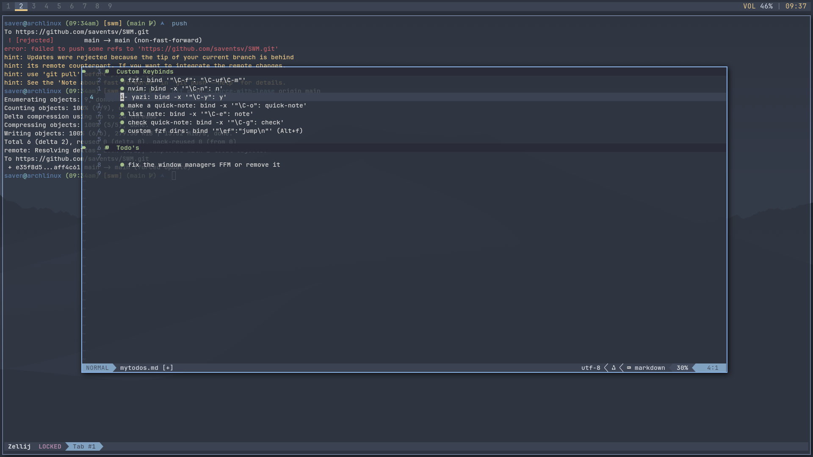

# SWM

## About

SWM is a configurable and hackable tiling window manager that is written in C using the Xlib library.

It is aims to be simple and hackable like its inspiration dwm but have some of the nicer features such as direcitonals focus, key chords, and scratchpads.




## Architecture

SWM is made off of the Xlib library, for simiplicity, control, and maximum performance

Core design principals:
- Event-driven architecture using X11 events such as MapRequest, DestroyNotify, ConfigureRequest, and KeyPress 
- Windows are stored in a linked list with the master being in the workspace and linking to all the others
- Layout recalculation happens on ever structural change such as MapRequest
- Static and perfomant configuration in config.h

The codebase is intentionally kept small and readable to aid in user modification and experimentation.

## Challanges

- implementing scratchpads and having consistent focus mechanics
- having consistent focus mechanics
- allowing for user input through config.h

## Differences from dwm

- Built-in key chord system
- Native scratchpad support
- Simplified configuration structure
- More explicit workspace management

## File Structure

- `main.c` -> the core logic
- `config.h` -> the configuration file
- `MakeFile` -> the build system

## Motivation

This project was created to have a window manager that has some of the customiziblity of dwm while not having to patch every little feature and have a more productivity foucs window managers and remove some of the shortcomings with window manager with more out of the box features such as Hyprland or i3.

## Features

- Tiling window managerment with master-stack
- Multiple workspaces
- Scratchpad support
- Key chords
- Configurable keybinds
- Autostart support
- External bar compatibility
- Lightweight and minimal-dependancy

## Configuraiton

- all configuration is done in config.h and recompiling:

```shell
sudo make clean install
```

## Installation

- required dependancies
    * Xlib
    * gcc
    * make

- run this command to install
```shell
git clone https://github.com/saventsv/SWM.git
cd SWM
sudo make clean install
```

## Usage

- to run, either add `exec swm` to you .xinitrc or it will pop up as an option in your display manager


