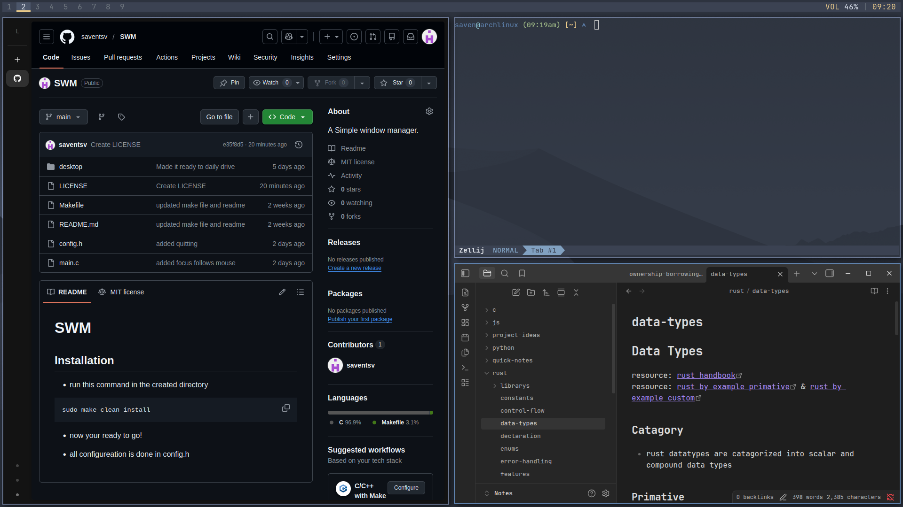

# SWM

## About

SWM is a configurable and hackable tiling window manager that is written in c using the Xlib library.

It is aims to be simple and hackable like its inspiration dwm but have some of the nicer features such as direcitonals focus, key chords, and scratchpads.



## Architecture

SWM is made off of the Xlib library, for simiplicity, control, and maximum performance

Core design principals:
- Event-driven architecture using X11 events
- Minimal state tracking for performance
- Static and perfomant configuration in config.h

The codebase is intentionally kept small and readable to aid in user modification and experimentation.

## Features

- Tiling window managerment with master-stack
- Multiple workspaces
- Scratchpad support
- Key chords
- Configurable keybinds
- Autostart support
- External bar compatibility
- Lightweight and minimal-dependancy

## Configuraiton

- all configuration is done in config.h and recompiling:

```shell
sudo make clean install
```

## Installation

- required dependancies
    * Xlib
    * gcc
    * make

- run this command to install
```shell
git clone https://github.com/saventsv/SWM.git
cd SWM
sudo make clean install
```

## Usage

- to run, either add `exec swm` to you .xinitrc or it will pop up as an option in your display manager


